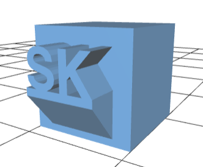

# scad-text
Simple OpenSCAD library to add 3D text (with optional pedestal to print vertical or sheer text) to OpenSCAD models. 

# Usage
You must place place the `scad_text.scad` file in your current path and import it (using `import <scad_text.scad>`).

The following function is exposed: `writeText(x, y, z, textIn, depth=4, size=5)`. This function draws the `textIn` string at the (x,y,z) coordinates with a depth of 4 units and at the specified size. Sample code is in `example.scad` and is copied below. A writeTextWithPedestal legacy function is exposed as well, which creates a pedestal/support under text at a fixed size.
```OpenSCAD
include <scad_text.scad>
translate([0,6,0])cube(10, center=true);
writeTextWithPedestal(0,0,0, "SK");
``` 

Produces:

[](https://github.com/suyashkumar/scad-text/blob/master/example/example.stl)

